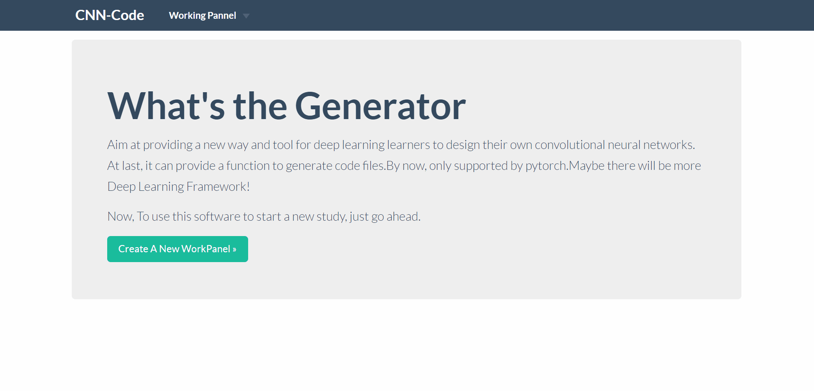
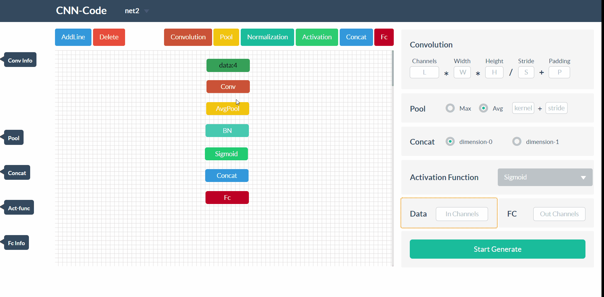
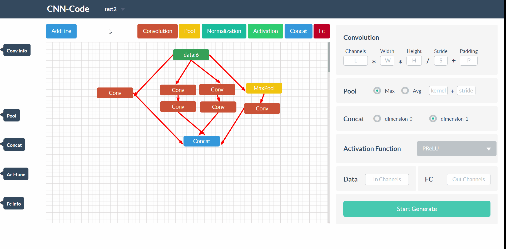

# CNN-CodeGenerator

> Author：zhiyu-Lin、yanglin-Chen 

>Date：2019-01-16

> E-mail：jhyxlzh@126.com

> Description：CNN-DIY & Generate Code

### Introduction

Aim at providing a new way and tool for deep learning learners to design their own convolutional neural networks. At last, it can provide a function to generate code files.By now, only supported by pytorch.Maybe there will be more Deep Learning Framework!

### How to run

python>=3.5

Django==2.0

```shell
$ python manage.py runserver
```

To input following url http://127.0.0.1:8000/apps/ to visit the Website.

### How to use

#### Create Panels

You can create a new panel on the first page.And when you working at the current panel,you can create a new panel and change panels on the topbar.The contents in panel that you are working now will be saved.



#### Design Your CNN

You can choose to create a  box by clicking the button,such as 'Convolution',we provide to you.And if you have focus on two boxs, you can choose to add a line between them by clicking 'AddLine' button. There are also operations such as deleting a box,deleting a line. 


To add the information of box,you should fullfill the inputs on the right side.Meantime,information and details are shown on the left side.You are only allowed to edit on the inputs which border is different from others.



After you finish your design, and make sure everything is right,you can click 'Start Generate' button on the right side.It will generate a code file corresponding the network you have designed that is supported by deep learning framework **pytorch**. 



### End

It is the homework of software lesson.It may be useful for study in the future,but most for fun.

I will appreciate if you can give advice.
